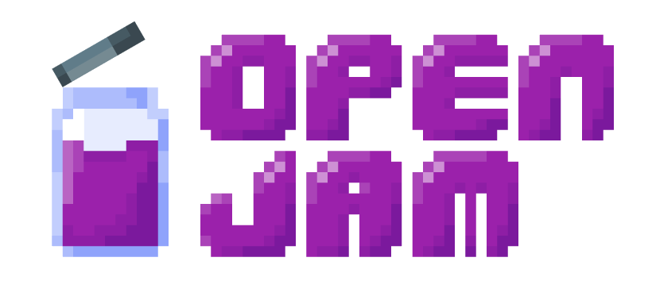
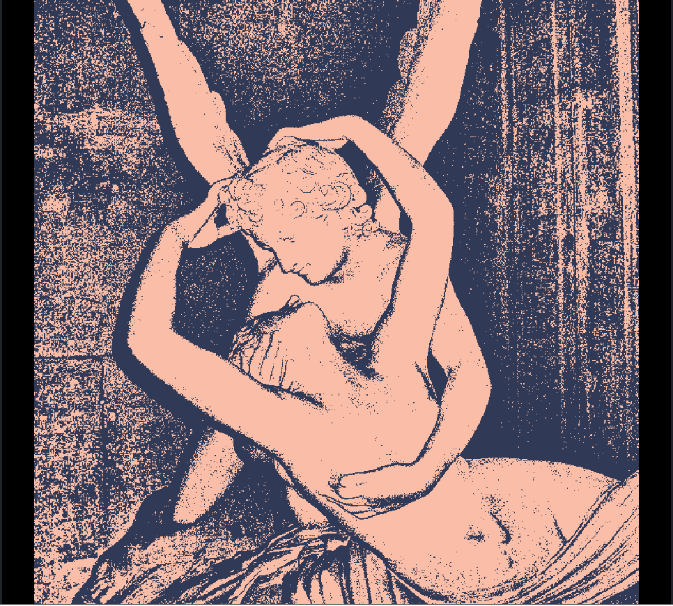
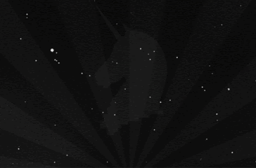
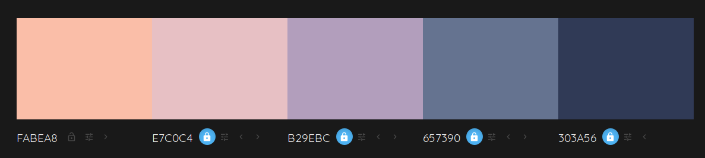

# Open Jam 2019

Duration: 80 hours (September 27th 7PM Central Time to October 1st 3AM)

To make long story short: Make an open-source game using open-source tools and assets.

## The Game

(Working) Title: <b>The Future of Love</b> 

## Theme

<b>THE FUTURE</b> 

## Tools I will be using

* Godot 3.1.1
* Audacity 2.1.2
* GNU Image Manipulation Program 2.10
* Krita 4.2.5

## Asset sources websites

* [Open Game Art](https://opengameart.org/)
* [Wikimedia Commons](https://commons.wikimedia.org/wiki/Main_Page)
* [Creative Commons on Bandcamp](https://bandcamp.com/tag/creative-commons)
* [Open Font Library](http://openfontlibrary.org/)

## Color Palette

